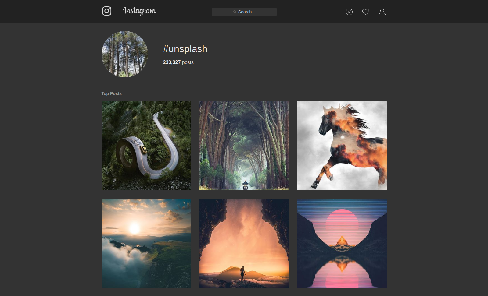

# Features

* The entire UI is converted to dark.
* Customizable colors, wide variety of light and dark color-schemes is supported.

# Preview

# Install 

To use this userstyle you must first install [Stylus](https://add0n.com/stylus.html) extension then click on the button above.

**NOTE:** _Stylish_ is only supported through [userstyles.org](https://userstyles.org/styles/151951).

# Contribute

Any sort of contribution is more than welcome. If you'd like to tip me then you can buy me a [ko-fi](http://ko-fi.com/vednoc).

# License

Code released under the [MIT](LICENSE) license.
